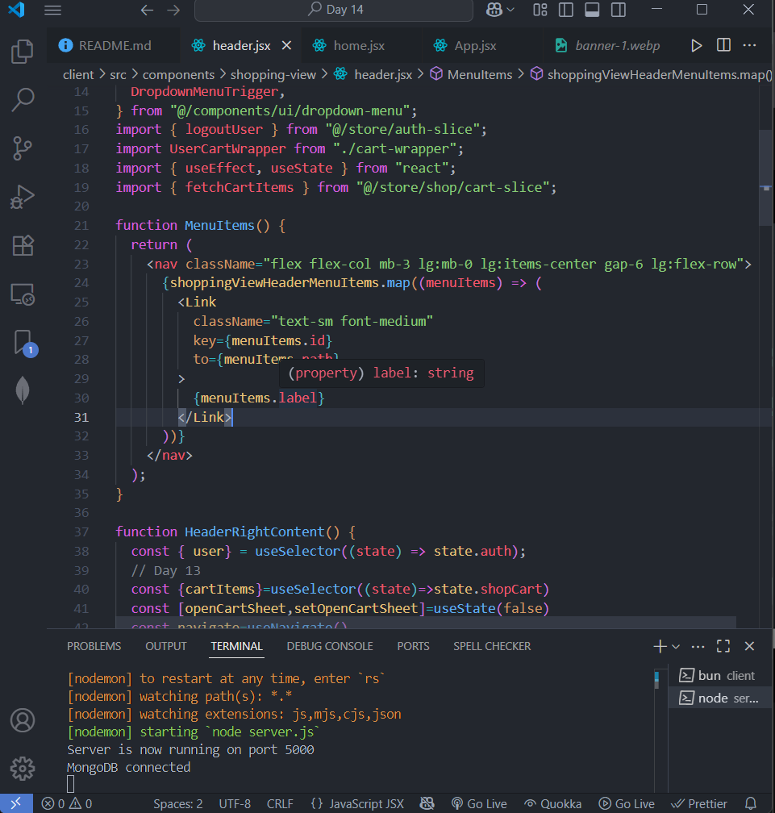

## Day 14
1. Shopping Home Page Design Only
- Go to the "home.jsx" file of "shopping-view" folder.
- Tut video => 8:12:38 - 8:35

2. Home Page Filter Functionality
- Create the function handleNavigateToListingPage() to navigate the each category/brand, to their filter sections.
- Tut video => 8:35 - 8:39:20

3. Header Filter Functionality
- Go to the "header.jsx" file under the "shopping-view" folder
- Modify the above <Link> part to the <Label> part => 

- Tut video => 8:39:20 - 8:43:05

4. Product Details and Add To Cart through the home Page
- Go to the "home.jsx" file and create the function "handleGetProductDetails()" and "handleAddtoCart()"
- Go to the down <Product> section to pass the props
- Import the <ProductDetailsDialog> to show the product details
- Tut video => 8:43:05 - 8:48:37