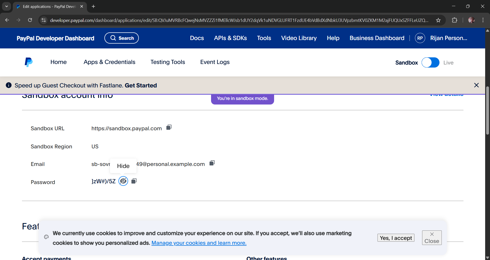

## Day 17 => Payment Functionality

## Paypal Developer Login Info
1. Seller Info
- Email => rijankhadgi100@gmail.com
- Password => Warriorop24 

2. Buyer Info
- Email => itzreason643@gmail.com
- Password => Warriorop24 

## Api Credentials
- Client ID => AUSYXF22YK10P9V0TM41I2Oho0I0gNDYyqTM7BfAdWFAE_-eBm23KEZ2_iw2or-DDO98XloADKUhn39T
- Secret Key => EPn28ePKKvTqAY5Cy5Unp1hwbwn7Uo0wcaJAZYzXGDTPrP915UYuDmrq8fkS05PbaGVYikzWPXpO0eU9

## Steps 
1. Creating a paypal developer account
Step 1 => Create a paypal account
Step 2 => Signup the paypal developer this link => https://developer.paypal.com
Step 3 => Go to this link to see the sanbox => https://developer.paypal.com/dashboard/accounts
Step 4 => Getting the api Credentials => https://developer.paypal.com/dashboard/applications/sandbox
-  Tut video => 10:17:45 - 10:20:07

2. Install the paypal package in backend
- PayPal REST SDK
- npm install paypal-rest-sdk

3. Backend Part
- Go to the "models" folder and create the "Order.js" file
- Go to the "helpers.js" folder and create the "paypal.js" file.
- Go to the "controllers" => "shop" and create the "order-controller.js" file.
- Note=> There is still little bit remaining to write code in the controller.js file which will be done in later video.
- Go to the "routes" => "shop" and create the "order-routes.js" file
- Tut video => 10:20:18 - 10:40:54

4. Frontend Part
- Go to "store" => "shop" => create "order-slice" folder.
- Go to "store.js" and import it.
- Go to "checkout.jsx" file to get the backend data, and to send the Address props from "<Address>"
- Go to the "address.jsx" file to pass the props to <AddressCard>
- Tut video => 10:40:55 - 10:58:38

## To Login For The Payment which is re-directed after the button click
- Login from the buyer account in the developer paypal account
- Go to this link => https://developer.paypal.com/dashboard/applications/sandbox
- Click on "default application" and search for email and password
- Email => sb-sovme45250849@personal.example.com
- Password => ]zW#)/5Z
- Pase that email and password and log in.
- 

5. Creating Paypal Page after the payment is successful and demonstration of payment
- Go to the "pages" => "shopping-view" => and create "paypal-return.jsx".
- Go to the "App.jsx" and create the path
- Tut video => 10:58:38 - 11:02:00
